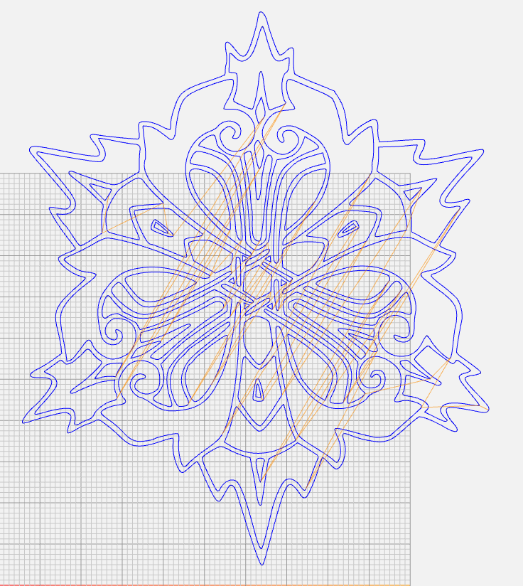
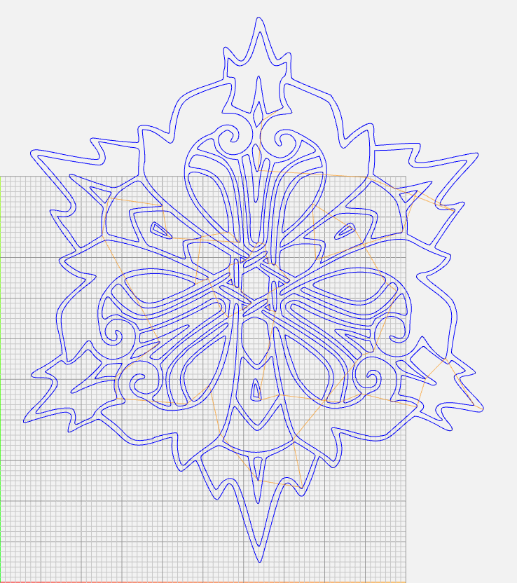

# g0-optim
Script optimizing G0 travel for CNC plotters, engavers and other XY based CNC machines, by solving the travelling salesman problem using the nearest neighbour method

Intended to be used with G-codes generated via https://github.com/sameer/svg2gcode , but should support any generic 2d G-codes

# Features
- Support for G2/G3 circular movement
- Automatic Metric/Imperial detection
- Automatic trimming of long float values
- Support for custom tool on/off sequences
- Support for custom program start/end sequences
- Optional line number generation

# Usage

```sh
g0-optim.py [-h] [-v | -q] [-F] [-N] [-t TRIM] [--toolon TOOLON] [--tooloff TOOLOFF] [-b BEGIN] [-e END] input_path [output_path]

positional arguments:
  input_path            Path to file containing input gcode
  output_path           Path to desired output location (default: [input_file]_optim.gcode in the input file
                        directory)

options:
  -h, --help                show this help message and exit
  -v, --verbose
  -q, --quiet
  -F, --keepF               Keep speed information (default: False)
  -N, --lineNr              Generate line numbers (default: False)
  -t TRIM, --trim TRIM      Amount of digits to keep after decimal point (default: 6)
  --toolon TOOLON           Tool On Sequence (default: M3)
  --tooloff TOOLOFF         Tool Off Sequence (default: M5)
  -b BEGIN, --begin BEGIN   Program Begin Sequence (default: )
  -e END, --end END         Program End Sequence (default: )
```

## Example
### Before

### After


Gcode visualisation: https://ncviewer.com/